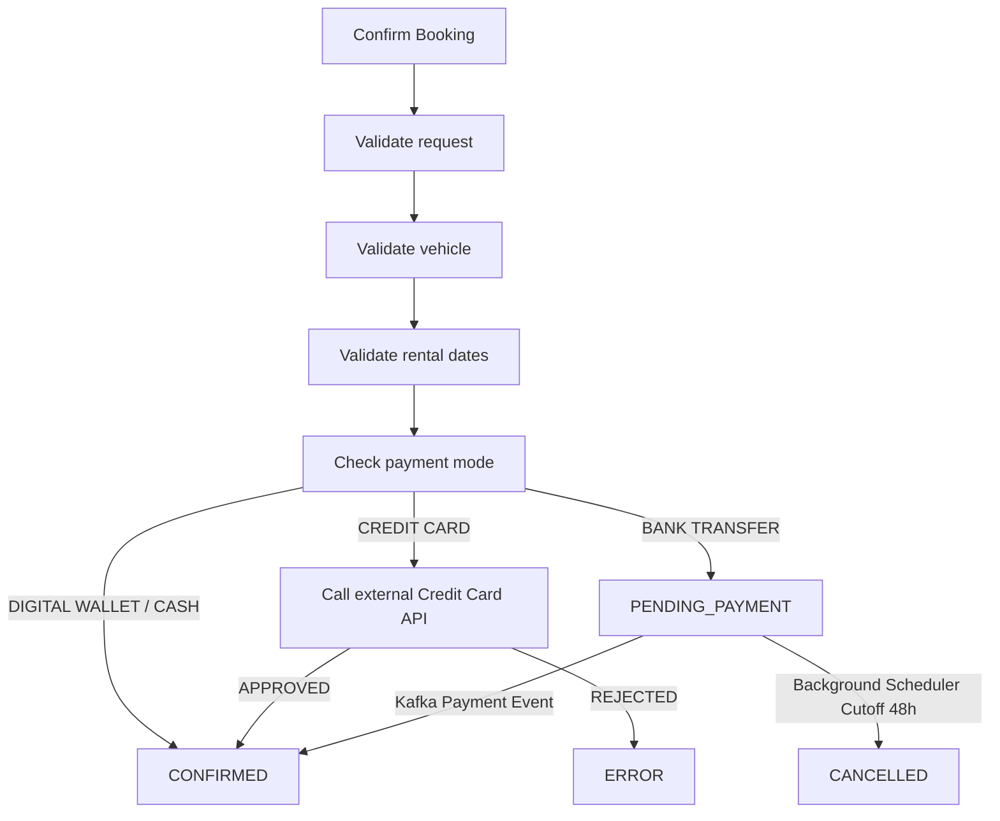

# Car Booking Service

Car Booking Service implemented as a Spring Boot application featuring an H2 in-memory database, Resilience4j fault tolerance, Kafka event integration, and an automated background cancellation scheduler.

## Requirements

- Java 17
- Maven

## Run

```text
mvn spring-boot:run
```

The service starts on `http://localhost:8080`.

The default profile is `local`, which uses the H2 in-memory database and enables the H2 console. To select a profile explicitly:

```text
mvn spring-boot:run -Dspring-boot.run.profiles=local
```

Tests use the `test` profile and a separate H2 database. The H2 console is disabled for tests.

## API Endpoints

### 1. Confirm a Booking (Core Requirement)

```http
POST http://localhost:8080/api/v1/bookings
Content-Type: application/json
```

```json
{
  "customerName": "Binu Philip",
  "vehicleId": "VH1001",
  "rentalStartDate": "2026-09-01T10:00:00",
  "rentalEndDate": "2026-09-05T10:00:00",
  "vehicleCategory": "SUV",
  "paymentMode": "DIGITAL_WALLET",
  "paymentReference": "WALLET123"
}
```

The response is `201 Created` with a `CONFIRMED` booking. Valid mock vehicle IDs are `VH1001`, `VH1002`, and `VH1003`.

### 2. Additional Testing / Utility Endpoints (Not Part of Core Requirement)

The following helper endpoints were added to facilitate manual testing and inspection of application state:

#### List All Bookings (`GET /api/v1/bookings`)

Allows reviewing all created bookings and verifying status transitions (e.g. `PENDING_PAYMENT` to `CONFIRMED` or `CANCELLED`).

```http
GET http://localhost:8080/api/v1/bookings
```

**Response (200 OK):**
```json
[
  {
    "bookingId": "BKG0000001",
    "customerName": "Binu Philip",
    "vehicleId": "VH1001",
    "rentalStartDate": "2026-09-01T10:00:00",
    "rentalEndDate": "2026-09-05T10:00:00",
    "vehicleCategory": "SUV",
    "paymentMode": "BANK_TRANSFER",
    "paymentReference": "PAY-10001",
    "bookingStatus": "PENDING_PAYMENT"
  }
]
```

#### Publish Bank Transfer Payment Event (`POST /api/v1/payment-events/bank-transfer`)

A helper endpoint to manually produce a bank-transfer payment event to the Kafka topic (`bank-transfer-payment-events`) for testing asynchronous payment confirmation without an external Kafka producer tool.

```http
POST http://localhost:8080/api/v1/payment-events/bank-transfer
Content-Type: application/json
```

```json
{
  "paymentId": "PAY-10001",
  "senderAccountNumber": "ACC-123456",
  "paymentAmount": 500.00,
  "transactionDetails": "TXN123456789 BKG0000001"
}
```

**Response (202 Accepted):** Returns the published event payload.

---

## Payment & Booking Rules

- **`CASH` & `DIGITAL_WALLET`:** Confirmed immediately upon booking request creation.
- **`CREDIT_CARD`:** Validated synchronously against the downstream Credit Card Validation Service. Confirmed when status is `APPROVED`. Service resilience is guarded via Resilience4j retries and circuit breaker.
- **`BANK_TRANSFER`:** Initial status set to `PENDING_PAYMENT`. Confirmed asynchronously when a matching payment event is received via Kafka. Unpaid bank-transfer bookings are automatically cancelled by a background scheduler if within 48 hours of rental start.

### Automatic Bank Transfer Cancellation Scheduler

A background task (`BankTransferBookingCancellationScheduler`) runs periodically (configurable via `booking.cancellation.fixed-delay-ms`, default 60 seconds). It scans for `PENDING_PAYMENT` bank-transfer bookings whose rental start date is within 48 hours (2880 minutes) of the current system time and marks them as `CANCELLED`.

### Booking Flow



## H2 Console & Actuator

- **H2 Console:** Available at `http://localhost:8080/h2-console`
  - **JDBC URL:** `jdbc:h2:mem:bookingdb`
  - **Username:** `sa`
  - **Password:** *(empty)*
- **Actuator Health & Metrics:** `http://localhost:8080/actuator/health`

## Test

```text
mvn test
```